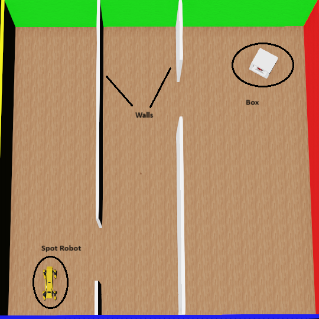

# DreamStride

Understanding and reconstructing the walking robot dog experiment from the
[DayDreamer paper](https://arxiv.org/abs/2206.14176) by Wu et al. (2022) within a simulated WeBots environment.

## Related Papers

- DayDreamer [\[Wu, et al. (2022)\]](https://arxiv.org/abs/2206.14176)
- MuDreamer [\[Burchi, Maxime & Timofte, Radu. (2024)\]](https://arxiv.org/abs/2405.15083)
- DreamerV3 [\[Hafner, et al. (2023)\]](https://arxiv.org/abs/2301.04104)
- DreamerV2 [\[Hafner, et al. (2020)\]](https://arxiv.org/abs/2010.02193)
- DreamerV1 [\[Hafner, et al. (2019)\]](https://arxiv.org/abs/1912.01603)

## Dreamer

This implementation was adapted from [DayDreamer Repository](https://github.com/danijar/daydreamer) 
and [Adityabingi/Dreamer](https://github.com/adityabingi/Dreamer).

DayDreamer learns a world model and an actor critic behavior to train robots from small
amounts of experience in the real world, without using simulators. At a high level,
DayDreamer consists of two processes. The actor process interacts with the environment
and stores experiences into the replay buffer. The learner samples data from the replay
buffer to train the world model, and then uses imagined predictions of the world model
to train the behavior.

To learn from proprioceptive and visual inputs alike, the world model fuses the sensory
inputs of the same time step together into a compact discrete representation.
A recurrent neural network predicts the sequence of these representations given actions.
From the resulting recurrent states and representations, DayDreamer reconstructs
its inputs and predicts rewards and episode ends.

Given the world model, the actor critic learns farsighted behaviors using
on-policy reinforcement learning purely inside the representation space of the world model.

For more information:

- [Project website](https://danijar.com/project/daydreamer/)
- [Research paper](https://arxiv.org/pdf/2206.14176.pdf)
- [YouTube video](https://www.youtube.com/watch?v=xAXvfVTgqr0)

## Setup

1) Install [WeBots](https://cyberbotics.com/).
2) Create a VEnv or Conda environment. Select the Python version compatible with WeBots (see [here](https://cyberbotics.com/doc/guide/using-python), this project was written with Python `3.9.0`).
3) Install the required packages: `pip install -r requirements.txt`.
4) This project was written in [PyCharm](https://www.jetbrains.com/pycharm/). If you use PyCharm as well, open the project there and set the Python interpreter to the one created in step $2$.
5) Follow the PyCharm-specific instructions in the [WeBots documentation](https://cyberbotics.com/doc/guide/using-your-ide?tab-language=c%20%20&tab-os=windows#pycharm).
   - The WeBots controller file is located at `./spotcontroller/spot_controller.py`.

## Training

1) Open WeBots and load the `./SimulationEnv/worlds/DayDreamerWorld.wbt` world file.
2) Within WeBots' components tree, navigate to the `spot` robot and:
   - Ensure the robot's property `controller` is set to `<extern>`
   - Ensure the robot's property `supervisor` is set to `true`
3) Keep WeBots open and running.
4) Open PyCharm and run the `./spot_controller/spot_controller.py` file. If everything is set correctly, you should see the message `[+] Spot Controller is alive. Waiting for connections...` appear.
5) While the controller runs, within PyCharm, open a terminal and:
   - Run training: `python dreamer.py --env spot-walk --algo Dreamerv2 --exp spot-webots --train`
   - Run evaluation: `python dreamer.py --env spot-walk --algo Dreamerv2 --exp spot-webots --evaluate`
   - If you have a CUDA-compatible GPU, you can add the `--gpu` flag to the command to use it.

## Implementation Details

This implementation aims to integrate the operation of the DayDreamer algorithm with the WeBots platform
in a performant and modular manner. To do so, we aim for this architecture:

A core part of the training adaptation for WeBots and the Spot robot therein was realized within `./spotcontroller/spot_controller.py`. This file is responsible for communicating with the WeBots simulation environment, acting out the actions, perceiving the observations, and providing the rewards to the DayDreamer algorithm. Communication between DayDreamer and WeBots was realized through a double socket connection for modularity and extendability.

The counterpart to the `./spotcontroller/spot_controller.py` is the `spot_wrapper.py`. 
It receives actions derived by the algorithm, formats and packages them nicely, and sends them to the controller. 
In turn, it also receives observations and rewards, and formats them and then forwards them to the algorithm.

Additional modifications have been made throughout the implementation, but, in general, `spot_controller.py`, `spot_wrapper.py`, and `dreamer.py` are the main files that can serve as good points of entry.

An example WeBots world for the Spot robot is located at `./SimulationEnv/worlds/DayDreamerWorld.wbt`:

## Folder Overview

- `./data` will contain training logs and model checkpoints.
- `./SimulationEnv` contains WeBots world files and other directly WeBots-related files.
- `./spotcontroller` contains the WeBots Spot robot controller and a tester file `dummy_backend.py`

## Roadmap

- [ ] Extend and optimize training and evaluation scripts for more/different simulated environments
- [ ] Integrate logging and visualization tools for training progress and model performance
- [ ] Improve codebase modularity and extensibility for additional robot types, tasks
- [ ] Test new, more interpretable reward functions that effectively guide smaller RL agents to achieve complex goals while balancing multiple, potentially conflicting objectives